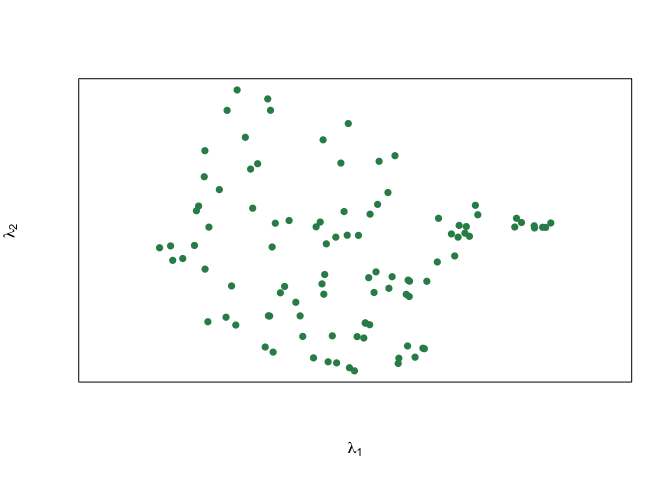

<!-- README.md is generated from README.Rmd. Please edit that file -->

# prinsurf

<!-- badges: start -->
<!-- badges: end -->

The goal of prinsurf is to …

## Installation

You can install the development version of prinsurf from
[GitHub](https://github.com/) with:

``` r
# install.packages("devtools")
devtools::install_github("RaeesaGaney91/prinsurf")
#> Downloading GitHub repo RaeesaGaney91/prinsurf@HEAD
#> yaml        (2.3.8  -> 2.3.10) [CRAN]
#> rlang       (1.1.3  -> 1.1.4 ) [CRAN]
#> fastmap     (1.1.1  -> 1.2.0 ) [CRAN]
#> digest      (0.6.35 -> 0.6.37) [CRAN]
#> fs          (1.6.4  -> 1.6.5 ) [CRAN]
#> glue        (1.7.0  -> 1.8.0 ) [CRAN]
#> cli         (3.6.2  -> 3.6.3 ) [CRAN]
#> cachem      (1.0.8  -> 1.1.0 ) [CRAN]
#> tinytex     (0.51   -> 0.54  ) [CRAN]
#> fontawesome (0.5.2  -> 0.5.3 ) [CRAN]
#> bslib       (0.7.0  -> 0.8.0 ) [CRAN]
#> rmarkdown   (2.26   -> 2.29  ) [CRAN]
#> jsonlite    (1.8.8  -> 1.8.9 ) [CRAN]
#> rgl         (1.3.1  -> 1.3.14) [CRAN]
#> Installing 14 packages: yaml, rlang, fastmap, digest, fs, glue, cli, cachem, tinytex, fontawesome, bslib, rmarkdown, jsonlite, rgl
#> 
#> The downloaded binary packages are in
#>  /var/folders/kc/w5qz00cn5qn_j_5kg82vg3gc0000gn/T//RtmpGRFRr4/downloaded_packages
#> ── R CMD build ─────────────────────────────────────────────────────────────────
#>      checking for file ‘/private/var/folders/kc/w5qz00cn5qn_j_5kg82vg3gc0000gn/T/RtmpGRFRr4/remotes70202adcf375/RaeesaGaney91-prinsurf-ea6a3ef/DESCRIPTION’ ...  ✔  checking for file ‘/private/var/folders/kc/w5qz00cn5qn_j_5kg82vg3gc0000gn/T/RtmpGRFRr4/remotes70202adcf375/RaeesaGaney91-prinsurf-ea6a3ef/DESCRIPTION’ (477ms)
#>   ─  preparing ‘prinsurf’:
#>      checking DESCRIPTION meta-information ...  ✔  checking DESCRIPTION meta-information
#>   ─  checking for LF line-endings in source and make files and shell scripts (425ms)
#>   ─  checking for empty or unneeded directories
#>     ─  building ‘prinsurf_1.0.tar.gz’
#>      
#> 
```

## Example

This is a basic example which shows you how to solve a common problem:

``` r
library(prinsurf)
surface <- principal.surface(iris[,1:3])
#> [1] 1.0000000 0.1863326 7.2079573
#> [1] 2.000000000 0.003988568 7.179207870
#> [1] 3.00000000 0.06336495 7.63411800
#> [1] 4.00000000 0.08301524 7.00036984
#> [1] 5.00000000 0.01244264 7.08747294
#> [1] 6.00000000 0.05079004 7.44744594
#> [1] 7.00000000 0.05868702 7.88451431
#> [1] 8.00000000 0.02749157 7.66775665
#> [1] 9.0000000 0.1244757 8.6222062
#> [1] 10.00000000  0.04449618  8.23855097
```


