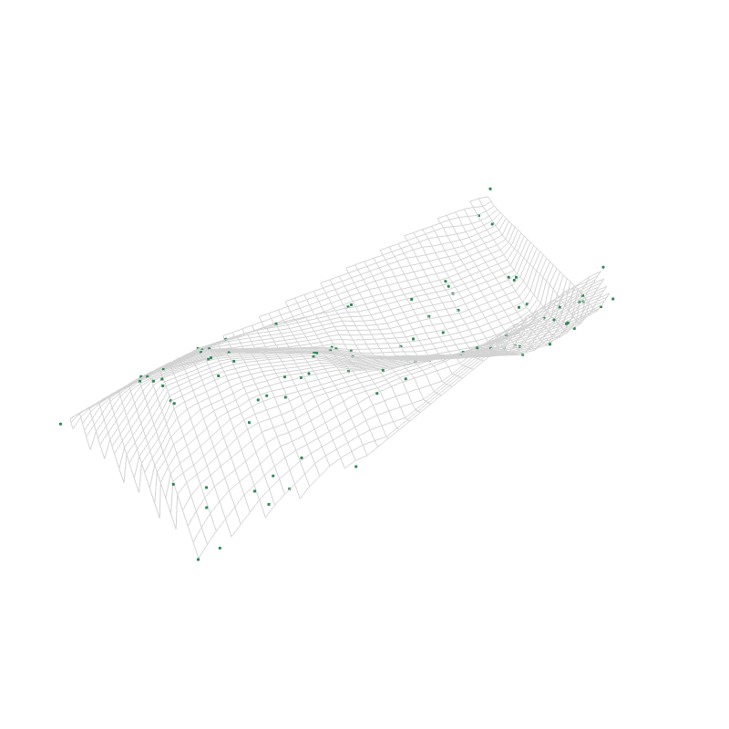

<!-- README.md is generated from README.Rmd. Please edit that file -->

# prinsurf

<!-- badges: start -->
<!-- badges: end -->

The goal of prinsurf is to construct a principal surfaces that are
two-dimensional surfaces that pass through the middle of a
$p$-dimensional dataset.

## Installation

You can install the development version of prinsurf from
[GitHub](https://github.com/) with:

``` r
library(devtools)
devtools::install_github("RaeesaGaney91/prinsurf")
```

## Example

This is a basic example on a simulated data set:

``` r
library(prinsurf)
surface <- principal.surface(X)
#> [1] 1.0000000 0.7569313 1.2344968
#> [1] 2.00000000 0.03523377 1.19100080
#> [1] 3.000000000 0.007027989 1.182630461
#> [1] 4.00000000 0.07623721 1.27279091
#> [1] 5.00000000 0.04798643 1.33386760
#> [1] 6.00000000 0.07692321 1.43647298
#> [1] 7.000000000 0.001892267 1.439191173
#> [1] 8.000000000 0.004302639 1.445383493
#> [1] 9.00000000 0.02918087 1.48756104
#> [1] 10.000000000  0.005471877  1.479421285
```


<figure>

<figcaption aria-hidden="true">3D Plot</figcaption>
</figure>

## Report Bugs and Support

If you encounter any issues or have questions, please open an issue on
the GitHub repository.
