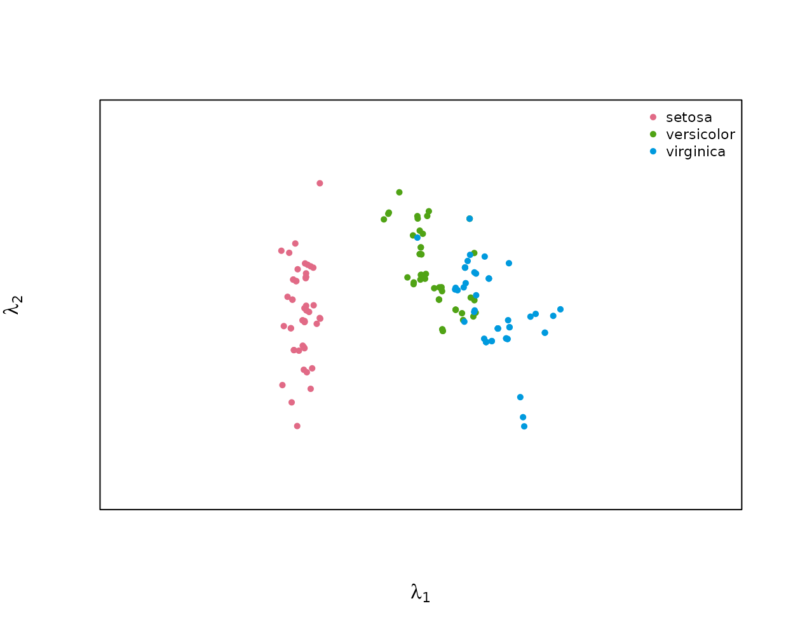
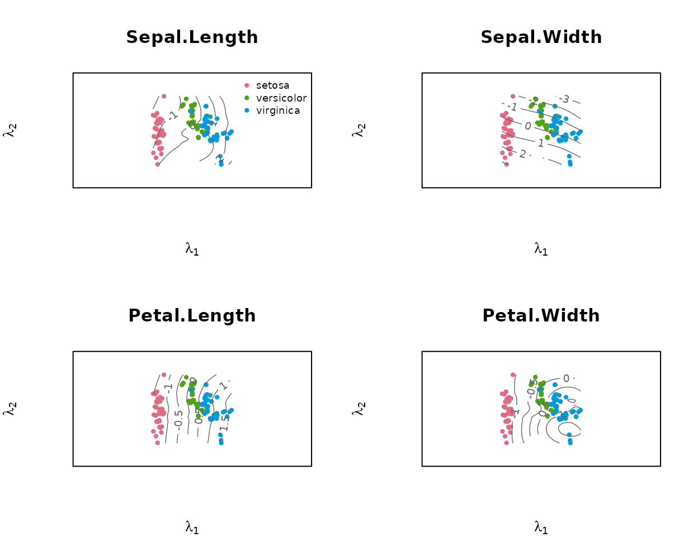
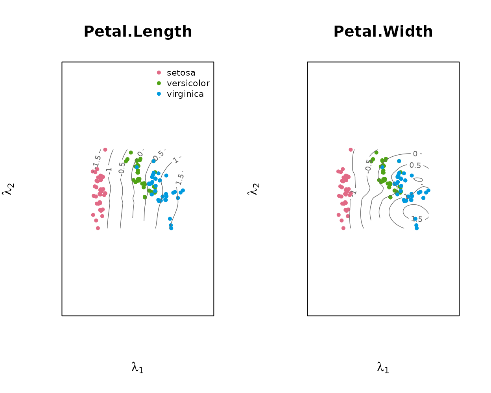
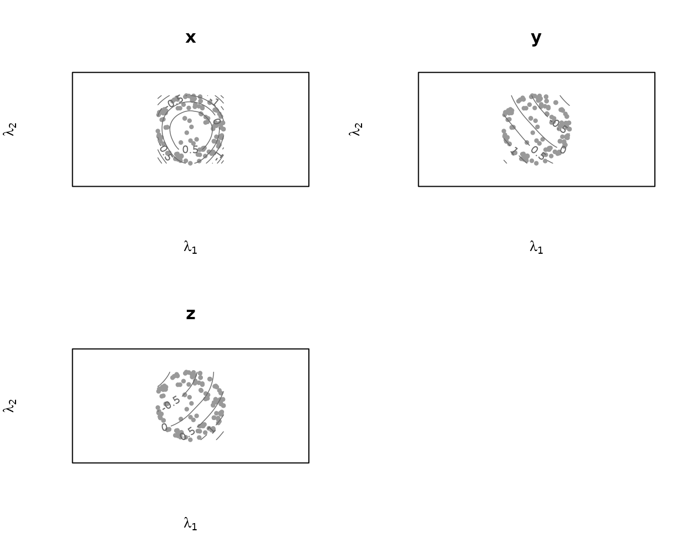
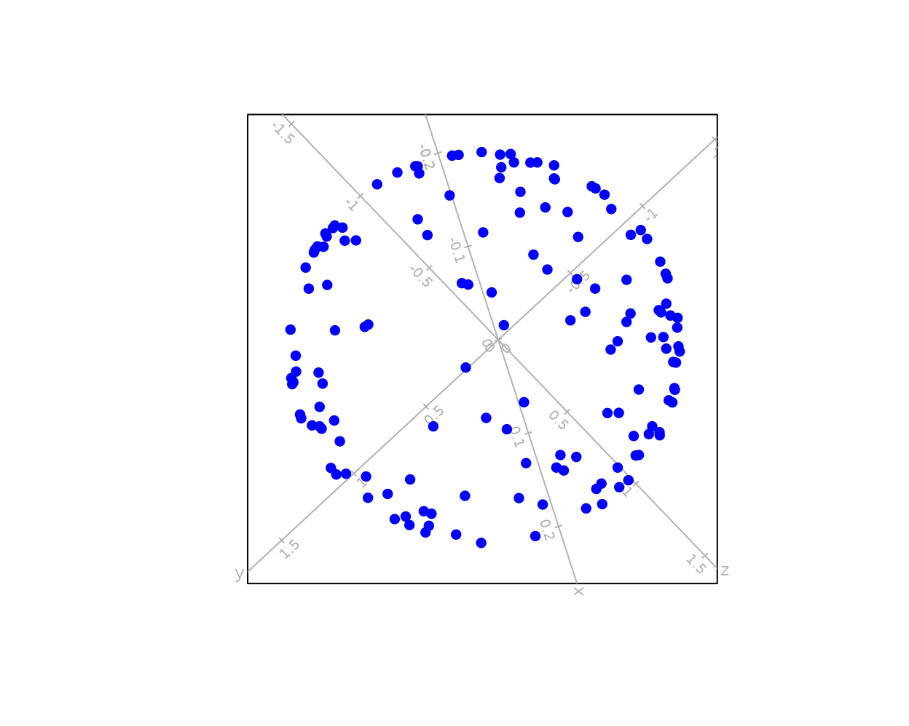

# Principal-surface contour biplots

## What this package does

A **principal surface** (Hastie & Stuetzle, 1989) is a smooth curved
two-dimensional manifold fitted through a data set, generalising the
first two principal components to nonlinear structure. `prinsurf` fits
such a surface and displays it as a biplot: the samples are plotted at
their surface coordinates $`\boldsymbol\lambda_i`$, and each variable is
shown as the contour lines of its fitted coordinate function
\$\widehat{f\mkern-2mu}\_j(\boldsymbol\lambda)\$ over that plane. A
variable’s value for a sample is read off by locating the sample among
the contour lines, the direct nonlinear generalisation of reading a
straight biplot axis.

## Fitting a surface and drawing the biplot

``` r

library(prinsurf)

fit <- prinsurf(iris[, 1:4], scale = TRUE)   # standardise heterogeneous units
fit
#> Principal surface fit: 150 samples, 4 variables
#>   loess span 0.60, converged in 10 iterations
#>   variables: Sepal.Length, Sepal.Width, Petal.Length, Petal.Width
```

With no `vars` argument,
[`plot()`](https://rdrr.io/r/graphics/plot.default.html) draws a bare
scatter of the sample coordinates:

``` r

plot(fit, group = iris$Species)
```



Passing `vars` adds one panel per named variable, each with that
variable’s contour lines over the sample coordinates:

``` r

plot(fit, vars = colnames(iris)[1:4], group = iris$Species)
```



Any subset can be requested:

``` r

plot(fit, vars = c("Petal.Length", "Petal.Width"), group = iris$Species)
```



## Reading the variables: predict() and its error

[`predict()`](https://rdrr.io/r/stats/predict.html) reads every
variable’s value for each sample off that variable’s contour lines at
the sample’s biplot position $`\boldsymbol\lambda_i`$, the same
interpolation used to draw the contours above and returns an
$`n \times p`$ matrix on the variables’ original scales. Values come
from the contour grid alone; a sample whose position is not covered by
the supported part of the grid has no contours to read and is returned
as `NA`.

``` r

phat <- predict(fit)
head(round(phat, 2))
#>      Sepal.Length Sepal.Width Petal.Length Petal.Width
#> [1,]         5.04        3.50         1.51        0.28
#> [2,]         4.81        3.03         1.60        0.26
#> [3,]         4.70        3.20         1.42        0.19
#> [4,]         4.65        3.10         1.42        0.19
#> [5,]         4.88        3.62         1.43        0.23
#> [6,]         5.46        3.91         1.61        0.34
head(iris[, 1:4])
#>   Sepal.Length Sepal.Width Petal.Length Petal.Width
#> 1          5.1         3.5          1.4         0.2
#> 2          4.9         3.0          1.4         0.2
#> 3          4.7         3.2          1.3         0.2
#> 4          4.6         3.1          1.5         0.2
#> 5          5.0         3.6          1.4         0.2
#> 6          5.4         3.9          1.7         0.4
```

Note that [`predict()`](https://rdrr.io/r/stats/predict.html) and
[`fitted()`](https://rdrr.io/r/stats/fitted.values.html) answer
different questions.
[`fitted()`](https://rdrr.io/r/stats/fitted.values.html) gives
\$\widehat{f\mkern-2mu}(\boldsymbol\lambda_i)\$ exactly, in the
centred/scaled units used for fitting – the surface’s own reconstruction
of each sample. [`predict()`](https://rdrr.io/r/stats/predict.html)
gives what a reader interpolating between the printed contour lines
would obtain, on the original measurement scales.

[`contour_predictive_error()`](https://raeesaganey91.github.io/prinsurf/reference/contour_predictive_error.md)
measures this reading against the samples’ actual values, per variable,
as a root-mean-square error in the working (centred/scaled) units:

``` r

contour_predictive_error(fit)
#> Sepal.Length  Sepal.Width Petal.Length  Petal.Width 
#>    0.1932339    0.1305817    0.1239186    0.2063036 
#> attr(,"overall")
#> [1] 0.1635094
#> attr(,"n.unread")
#> [1] 0
```

## Diagnostics: sample predictivity

Two diagnostics look at surface fit from different angles:
[`contour_predictive_error()`](https://raeesaganey91.github.io/prinsurf/reference/contour_predictive_error.md)
above measures reading *one variable at a time* from its contours, while
**sample predictivity** asks how well the surface reconstructs each
*whole* sample, \$\widehat{\boldsymbol x\mkern-3mu}\_i =
\widehat{f\mkern-2mu}(\boldsymbol\lambda_i)\$, as the proportion of the
sample’s squared length that the fit recovers, \$1 - \lVert \boldsymbol
x_i - \widehat{f\mkern-2mu}(\boldsymbol\lambda_i) \rVert^2 / \lVert
\boldsymbol x_i \rVert^2\$. It is read from the sample’s *position* on
the surface and is the principal-surface analogue of biplot sample
predictivity.

``` r

pred <- predictivity(fit)
summary(pred)
#>    Min. 1st Qu.  Median    Mean 3rd Qu.    Max. 
#>  0.5423  0.9193  0.9792  0.9377  0.9947  0.9998
attr(pred, "overall")
#> [1] 0.9377464

## PCA biplot (rank-2) sample predictivity on the same standardised data, for comparison
Z   <- scale(as.matrix(iris[, 1:4]))
V2  <- svd(Z)$v[, 1:2]; Zhat <- Z %*% V2 %*% t(V2)
pca <- mean(1 - rowSums((Z - Zhat)^2) / rowSums(Z^2))

c(principal_surface = round(attr(pred, "overall"), 3), pca_biplot = round(pca, 3))
#> principal_surface        pca_biplot 
#>             0.938             0.918
```

Here the curved surface reconstructs the samples better than the flat
PCA biplot, because it captures nonlinear structure that a plane cannot.

## Contour biplot versus a PCA biplot

A PCA biplot represents every variable by a single straight axis, so it
can only show structure that is linear in the two leading principal
components. The upper cap of a sphere makes the contrast with a contour
biplot concrete: its height coordinate `x` has an interior maximum over
the fitted surface (closed, concentric contours), while `y` and `z` vary
monotonically.

``` r

## upper cap of a sphere: x = height, y, z = horizontals
n <- 200; u <- 2 * runif(n) - 1; th <- 2 * pi * runif(n) - pi
S <- cbind(x = u, y = sin(th) * sqrt(1 - u^2), z = cos(th) * sqrt(1 - u^2))
S <- S[S[, "x"] > -0.4, ]                 # keep the cap
S <- sweep(S, 2, colMeans(S))             # centre
sph <- prinsurf(S, max.iter = 8)
plot(sph, vars = colnames(S))
```



`x`’s closed contours are visible directly; `y` and `z` show open,
roughly parallel contours. A PCA biplot of the same data, drawn with
[biplotEZ](https://CRAN.R-project.org/package=biplotEZ), shows what a
flat, straight-axis representation does with the same structure:

``` r

biplotEZ::biplot(data = S) |> biplotEZ::PCA() |> plot()
```



The samples form a hollow ring: the two leading principal components
recover only `y` and `z`, and `x` almost orthogonal to that plane
collapses to near-zero variation across it. Every sample near the middle
of the height range sits close to the same spot regardless of its actual
`x`, because a straight axis for `x` cannot express its interior
maximum. The contour biplot’s curved surface follows that maximum
instead of flattening it away.

Sample predictivity makes the same point numerically, and unlike the
near-planar iris data above the gap here is large:

``` r

ps  <- mean(predictivity(sph))

Zc  <- scale(S, scale = FALSE)
V2  <- svd(Zc)$v[, 1:2]; Zhat <- Zc %*% V2 %*% t(V2)
pca <- mean(1 - rowSums((Zc - Zhat)^2) / rowSums(Zc^2))

c(principal_surface = round(ps, 3), pca_biplot = round(pca, 3))
#> principal_surface        pca_biplot 
#>             0.977             0.818
```

## Reference

The underlying methodology is the principal surface of Hastie & Stuetzle
(1989) and the contour biplot framework of Raeesa Ganey’s PhD, Biplots
based on Principal Surfaces (2020)
